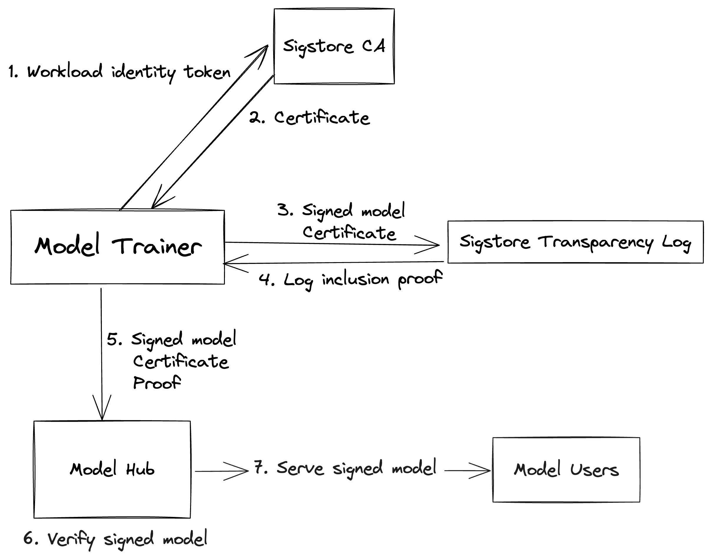

# Model Transparency

<!-- markdown-toc --bullets="-" -i README.md -->

<!-- toc -->

- [Overview](#overview)
- [Model Signing](#model-signing)
  - [Model Signing CLI](#model-signing-cli)
  - [Model Signing API](#model-signing-api)
  - [Model Signing Format](#model-signing-format)
- [SLSA for ML](#slsa-for-ml)
- [Status](#status)
- [Contributing](#contributing)

<!-- tocstop -->

## Overview

There is currently significant growth in the number of ML-powered applications.
This brings benefits, but it also provides grounds for attackers to exploit
unsuspecting ML users.

Building on the work with [Open Source Security Foundation][openssf], we are
creating this collection of projects to strengthen the ML supply chain in
_the same way_ as the traditional software supply chain.

The focus is on providing *verifiable* claims about the integrity and provenance
of the resulting models, meaning users can check for themselves that these
claims are true rather than having to just trust the model trainer.

## Model Signing

This project demonstrates how to protect the integrity of a model by signing it.
We support generating signatures via [Sigstore](https://www.sigstore.dev/), a
tool for making code signatures transparent without requiring management of
cryptographic key material. But we also support traditional signing methods, so
models can be signed with public keys or signing certificates.

The signing part creates a
[sigstore bundle](https://github.com/sigstore/protobuf-specs/blob/main/protos/sigstore_bundle.proto)
protobuf that is stored as in JSON format. The bundle contains the verification
material necessary to check the payload and a payload as a
[DSSE envelope](https://github.com/sigstore/protobuf-specs/blob/main/protos/envelope.proto).
Further the DSSE envelope contains an in-toto statment and the signature over
that statement. The signature format and how the the signature is computed can
be seen
[here](https://github.com/secure-systems-lab/dsse/blob/v1.0.0/protocol.md).

Finally, the statement itself contains subjects which are a list of (file path,
digest) pairs a predicate type set to `https://model_signing/signature/v1.0` and
a dictionary of predicates. The idea is to use the predicates to store (and
therefor sign) model card information in the future.

The verification part reads the sigstore bundle file and firstly verifies that the
signature is valid and secondly compute the model's file hashes again to compare
against the signed ones.

When users download a given version of a signed model they can check that the
signature comes from a known or trusted identity and thus that the model hasn't
been tampered with after training.

When using Sigstore, signing events are recorded to Sigstore's append-only
transparency log.  Transparency logs make signing events discoverable: Model
verifiers can validate that the models they are looking at exist in the
transparency log by checking a proof of inclusion (which is handled by the model
signing library).  Furthermore, model signers that monitor the log can check for
any unexpected signing events.

Model signers should monitor for occurences of their signing identity in the
log. Sigstore is actively developing a [log
monitor](https://github.com/sigstore/rekor-monitor) that runs on GitHub Actions.



### Model Signing CLI

After installing the package, the CLI can be used via either `python -m
model_signing <args>` or by calling the binary directly, `model_signing <args>`.

Users that don't want to install the package, but want to test this using the
repository can do the same using [Hatch](https://hatch.pypa.io/latest/) via
`hatch run python -m model_signing <args>`.

For the remainder of the section, we would use `model_signing <args>` method.

The CLI has two subcommands: `sign` for signing and `verify` for verification.
Each subcommand has another level of subcommands to select the signing method
(`sigstore` -- the default, can be skipped --, `key`, `certificate`). Then, each
of these subcommands has several flags to configure parameters for
signing/verification.

For the demo, we will use the `bert-base-uncased` model, which can be obtained
via:

```bash
[...]$ git clone --depth=1 "https://huggingface.co/bert-based-uncased
```

We remove the `.git` directory since that should not be included in the
signature:

```bash
[...]$ rm -rf bert-base-uncased/.git
```

By default, the code also ignores git related paths.

The simplest example of the CLI is to sign a model using Sigstore:

```bash
[...]$ model_signing sign bert-base-uncased
```

This will open an OIDC flow to obtain a short lived token for the certificate.
The identity used during signing and the provider must be reused during
verification.

As another example, here is how we can sign with private keys. First, we
generate the key pair:

```bash
[...]$ openssl ecparam -name prime256v1 -genkey -noout -out key.priv
[...]$ openssl ec -in key.priv -pubout > key.pub
```

And then we use the private key to sign.

```bash
[...]$ model_signing sign key bert-base-uncased --private_key key.priv
```

All signing methods support changing the signature name and location via the
`--signature` flag:

```bash
[...]$ model_signing sign bert-base-uncased --signature model.sig
```

Consult the help for a list of all flags (`model_signing --help`, or directly
`model_signing` with no arguments)

On verification we use the `verify` subcommand. To verify a Sigstore signed
model we use

```bash
[...]$ model_signing verify bert-base-uncased \
      --signature model.sig \
      --identity "$identity" \
      --identity_provider "$oidc_provider"
```

Where `$identity` and `$oidc_provider` are those set up during the signing flow
and `--signature` must point to the signature to verify.

For developers signing models with Sigstore, there are three identity providers
that can be used at the moment:

* Google's provider is `https://accounts.google.com`.
* GitHub's provider is `https://github.com/login/oauth`.
  * GitHub Actions uses `https://token.actions.githubusercontent.com`
* Microsoft's provider is `https://login.microsoftonline.com`.

For automated signing using a workload identity, the following platforms
are currently supported, shown with their expected identities:

* GitHub Actions
  (`https://github.com/octo-org/octo-automation/.github/workflows/oidc.yml@refs/heads/main`)
* GitLab CI
  (`https://gitlab.com/my-group/my-project//path/to/.gitlab-ci.yml@refs/heads/main`)
* Google Cloud Platform (`SERVICE_ACCOUNT_NAME@PROJECT_ID.iam.gserviceaccount.com`)
* Buildkite CI (`https://buildkite.com/ORGANIZATION_SLUG/PIPELINE_SLUG`)

Similarly, for key verification, we can use

```bash
[...]$ model_signing verify key bert-base-uncased \
       --signature resnet.sig --public_key key.pub
```

### Model Signing API

We offer an API which can be used in integrations with ML frameworks, ML
pipelins and ML model hubs libraries. The CLI wraps around the API.

The API is split into 3 main components:

- `model_signing.hashing`: responsible with generating a list of hashes for
  every component of the model. A component could be a file, a file shard, a
  tensor, etc., depending on the method used. We currently support only files
  and file shards. The result of hashing is a manifest, a listing of hashes for
  every object in the model.
- `model_signing.signing`: responsible with taking the manifest and generating a
  signature, based on a signing configuration. The signing configuration can
  select the method used to sign as well as the parameters.
- `model_signing.verifying`: responsible with taking a signature and verifying
  it. If the cryptographic parts of the signature can be validated, the
  verification layer would return an expanded manifest which can then be
  compared agains a manifest obtained from hashing the existing model. If the
  two manifest don't match then the model integrity was compromised and the
  `model_signing` package detected that.

The first two of these components allows configurability but can also be used
directly, with a default configuration. The only difference is for the
verification component where we need to configure the verification method since
there are no sensible defaults that can be used.

The simplest way to generate a signature using Sigstore is:

```python
import model_signing

model_signing.signing.sign("bert-base-uncased", "model.sig")
```

This will run the same OIDC flow as when signing with Sigstore from the CLI.

We can use explicit configurations to configure more about the signing:

```python
import model_signing

model_signing.signing.Config().use_elliptic_key_signer(
    private_key="key.priv"
).sign(
    "finbert", "finbert.sig"
)
```

The same signing configuration can be used to sign multiple models:

```python
import model_signing

signing_config = model_signing.signing.Config().use_elliptic_key_signer(
    private_key="key.priv"
)

for model in all_models:
    signing_config.sign(model, f"{model}_sharded.sig")
```

Verification needs a configuration. To verify using Sigstore:

```python
import model_signing

model_signing.verifying.Config().use_sigstore_verifier(
    identity=identity, oidc_issuer=oidc_provider
).verify("finbert", "finbert.sig")
```

The same verification configuration can be used to verify multiple models:

```python
import model_signing

verifying_config = model_signing.signing.Config().use_elliptic_key_verifier(
    public_key="key.pub"
)

for model in all_models:
    verifying_config.verify(model, f"{model}_sharded.sig")
```

Consult the
[official documentation](https://sigstore.github.io/model-transparency/model_signing.html)
for more details.

### Model Signing Format

For a diagram showing the model signing format as well as an explanation of the
layers, see the [model signing format](docs/model_signing_format.md) document.

## SLSA for ML

This is a separate project from the `model_signing` package, aimed at generating
[SLSA][slsa] provenance for ML models, using either Github Actions or Google
Cloud Platform.

See [slsa_for_models/README.md](slsa_for_models/README.md) for more information.

## Contributing

Please see the [Contributor Guide](CONTRIBUTING.md) for more information.

[slsa]: https://slsa.dev/
[saif]: https://blog.google/technology/safety-security/introducing-googles-secure-ai-framework/
[openssf]: https://openssf.org/
[slsa-generator]: https://github.com/slsa-framework/slsa-github-generator
[solarwinds]: https://www.techtarget.com/whatis/feature/SolarWinds-hack-explained-Everything-you-need-to-know
