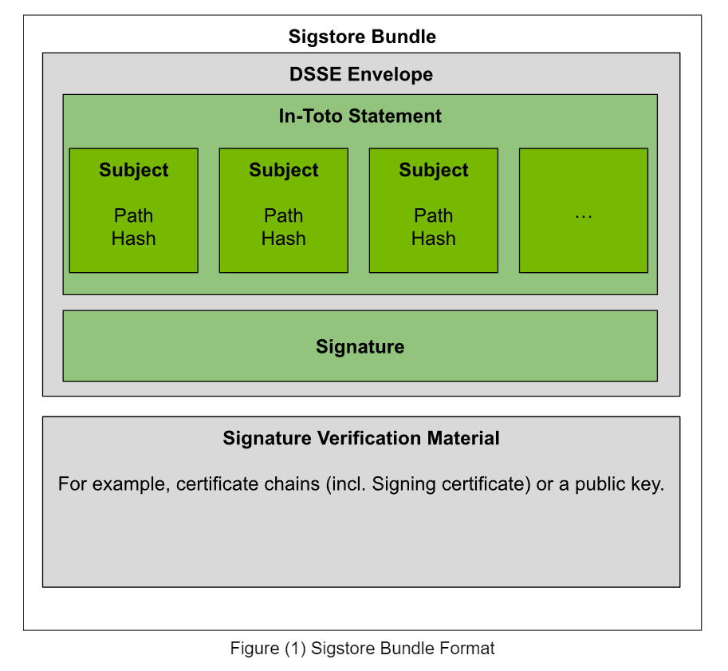

# Model Signing Format

This document describes the current model signing format that is produced by
this project's API.

The below diagram illustrates the current model signing format.

The sub-sections that follow briefly describes each format section and
associated links for more information.

## Format Diagram



## Format Description

The following sub-sections describe each layer in reverse order. This means the
order in which the data is wrapped starting with the smallest markdown heading
size representing the inner most In-Toto Statement layer, to sequentially larger
markdown heading sizes indicating the next outer layer wrapping.

##### In-Toto Statement

The innermost layer i.e. the manifest layer itself, uses the [In-Toto
Attestation Framework](https://github.com/in-toto/attestation) and specifically
uses the [In-Toto
Statement](https://github.com/in-toto/attestation/blob/80e7efeca762e8276ed5e04e6d8bc796a4a19170/spec/v1/statement.md)
attestation layer where each subject is a
[ResourceDescriptor](https://github.com/in-toto/attestation/blob/80e7efeca762e8276ed5e04e6d8bc796a4a19170/spec/v1/resource_descriptor.md)
field made up of `path:hash` entries, one per file. The main reason currently
for choosing In-Toto as the payload type of the DSSE Envelope is simply because
it is what is currently supported by the
[sigstore-python](https://github.com/sigstore/sigstore-python) library. That is,
the
[`sign_dsse`](https://github.com/sigstore/sigstore-python/blob/343cbbf46e15160a6c483b24bb316ef20f2341d5/sigstore/sign.py#L197)
API takes a
[`dsse.Statement`](https://github.com/sigstore/sigstore-python/blob/8578b545c2f8949211a185e5cf0ece7c17030a7a/sigstore/dsse.py#L81),
which represents an In-Toto Statement. See [sigstore-python issue
#982](https://github.com/sigstore/sigstore-python/issues/982) for tracking the
support for DSSE signatures over binary payloads.

#### DSSE Envelope

This is the next layer that wraps the In-Toto Statement and signature. The
project's goal is to create and sign a [manifest
file](https://github.com/sigstore/model-transparency/issues/111) that contains a
list of all files within a directory and their corresponding hash digests.
However, in order to avoid having two files, one for the manifest, and one for
the signature, the use of a [DSSE
Envelope](https://github.com/secure-systems-lab/dsse) was chosen to combine the
manifest and signature into a single file. See the [DSSE Envelope data structure
for storing DSSE signatures (aka "JSON
Envelope")](https://github.com/secure-systems-lab/dsse/blob/440901313676fedd0e31f16125c302b0df81e006/envelope.md)
and the
[protocol/algorithm](https://github.com/secure-systems-lab/dsse/blob/440901313676fedd0e31f16125c302b0df81e006/protocol.md)
used for more details.

### Sigstore Bundle

The outermost layer consists of the [Sigstore
Bundle](https://github.com/sigstore/protobuf-specs/blob/38622d0954012a20158e548ef5a683cfabb05fea/protos/sigstore_bundle.proto#L111-L149)
returned by the
[`sign_dsse`](https://github.com/sigstore/sigstore-python/blob/343cbbf46e15160a6c483b24bb316ef20f2341d5/sigstore/sign.py#L195)
API from the [sigstore-python](https://github.com/sigstore/sigstore-python)
library after passing it an In-Toto Statement. This API will sign the statement,
producing a DSSE envelope, along with a DSSE log entry that is submitted to the
transparency log.

## Example Format

Below is an example of the Sigstore bundle showing each of the layers described above.

```bash
$ cat model.sig | jq .
{
  "mediaType": "application/vnd.dev.sigstore.bundle.v0.3+json",
  "verificationMaterial": {
    "certificate": {
      "rawBytes": "MIICyjCCAk+gAwIBAgIUAZ5rGIxXimh7zYKck1wkRQMTFD8wCgYIKoZIzj0EAwMwNzEVMBMGA1UEChMMc2lnc3RvcmUuZGV2MR4wHAYDVQQDExVzaWdzdG9yZS1pbnRlcm1lZGlhdGUwHhcNMjQwOTE4MTUzNzM0WhcNMjQwOTE4MTU0NzM0WjAAMFkwEwYHKoZIzj0CAQYIKoZIzj0DAQcDQgAECb2CHlKZSXOjG8ZGzjXi/Yx6iycLz09cBEmgtJh5zEOTsmxlk1UQcd0rR1hfe5a4AuZUE6EnsASPBcHFF5a4qKOCAW4wggFqMA4GA1UdDwEB/wQEAwIHgDATBgNVHSUEDDAKBggrBgEFBQcDAzAdBgNVHQ4EFgQU0n4gkIqnJd1keiYAirClIzwVSoswHwYDVR0jBBgwFoAUcYYwphR8Ym/599b0BRp/X//rb6wwHgYDVR0RAQH/BBQwEoEQaWZvbnRAcmVkaGF0LmNvbTApBgorBgEEAYO/MAEBBBtodHRwczovL2FjY291bnRzLmdvb2dsZS5jb20wKwYKKwYBBAGDvzABCAQdDBtodHRwczovL2FjY291bnRzLmdvb2dsZS5jb20wgYoGCisGAQQB1nkCBAIEfAR6AHgAdgArMLzcaIjJ4uHYJiledB9IOTGWAvKcM8teQ0D+sqyGegAAAZIFyCG+AAAEAwBHMEUCIH6AJttpIbHJKgWwRuZVwn28CZMp5/11RoTVZbuPbczvAiEAuJHPbLRZtk22QnzM+KI2Qe00KzPjcUZY4ZIaqtGd7gAwCgYIKoZIzj0EAwMDaQAwZgIxAIcJTqD9zvXo8En7BMFCbwpouSa1zVGo6jk3/rXoBnxm6i1XPQmg3cO32PeTkEff9gIxAN96E0hgF9hNe+X4bIWBXPKXp5rCHwCVXhbG1sKQVcgamxQwX1GHnd6sLBa4EH1T3g=="
    },
    "tlogEntries": [
      {
        "logIndex": "33292044",
        "logId": {
          "keyId": "0y8wo8MtY5wrdiIFohx7sHeI5oKDpK5vQhGHI6G+pJY="
        },
        "kindVersion": {
          "kind": "dsse",
          "version": "0.0.1"
        },
        "integratedTime": "1726673855",
        "inclusionPromise": {
          "signedEntryTimestamp": "MEUCIQDCYHKs3kFQjvnNOZ4HbymmEzowaljDH7QcF9uUlZawfwIgJd2i5wVKJOvo+IJO8rVIXcp2QD6lPgBqyhiqi1DCoEM="
        },
        "inclusionProof": {
          "logIndex": "1609632",
          "rootHash": "EPrWchgdjHmtYpzpPUA1UPL851YctQquuROejTBxUTA=",
          "treeSize": "1609634",
          "hashes": [
            "kwrVsB1jTo3k264Szj8giANtlwLsEt5koXLH+CxcizU=",
            "g8gFeh4t8jYYzUOe+VVuXwujLAkV+TlQn7V1A5TB4Q0=",
            "Ts1LH5gfIQtMOIMSjVNBh/tWPiswCagoVP8OaVe4Zpc=",
            "RKMUCmZIiVBwJs6jzzGyCD0nzRHaTiJBAKZ5i+J9rNU=",
            "N+xCqNiLYreH3IFRSvJERXfq3mSafZOE7+b+NMyVZ8g=",
            "9ljoIqn5ijq05k2nMjBk+eIOTcA491gYk88Vkri2B64=",
            "YKByXXe8v4MopOdYBI3uuqgyjnAt3fe7WUB/Mn0n+F4=",
            "v1TtL2SEsSncOsWhtkYNC9fwsS+NXP0y9RLdePHlmL4=",
            "IEhPdnCEEzixupRSyd1Tp8JVX9qD/pbjNJ1xcTOOIUA=",
            "4DALt0AOaSvMvyCxf+fsF3q6I+e/023LdISTXM0hQzY="
          ],
          "checkpoint": {
            "envelope": "rekor.sigstage.dev - 8202293616175992157\n1609634\nEPrWchgdjHmtYpzpPUA1UPL851YctQquuROejTBxUTA=\n\n— rekor.sigstage.dev 0y8wozBGAiEAyC3HQTTqfDiGkk5lch7/wm+esSipi94mI7qV78czAgkCIQDJlu6hrCvoAt3jgxAJrWcCbhW6VysWqpdAyzPo1UpEMA==\n"
          }
        },
        "canonicalizedBody": "eyJhcGlWZXJzaW9uIjoiMC4wLjEiLCJraW5kIjoiZHNzZSIsInNwZWMiOnsiZW52ZWxvcGVIYXNoIjp7ImFsZ29yaXRobSI6InNoYTI1NiIsInZhbHVlIjoiODY1Y2M0NmE5YTc1OGQzMTQ2MjA2MWIyMTBhOGQ3OTYzNDhkMjhmM2Q3Zjk0NDM4ZGM2NjFiMWY4OGZkYzk1YiJ9LCJwYXlsb2FkSGFzaCI6eyJhbGdvcml0aG0iOiJzaGEyNTYiLCJ2YWx1ZSI6ImUwZjVlZjllMzk4MzM4OWIzZmM4ZjA1OWZhYzgxODRmYTM1YmM1ZjdiYmYzMTYxOTk5NjVhZTM2MTQ2MGJlNmUifSwic2lnbmF0dXJlcyI6W3sic2lnbmF0dXJlIjoiTUVRQ0lFSHYyTWZ6WTkvTkxUSDVOZWUzTUwzRzgxL3JKL0psZ01nRDcxZHg2Tnh0QWlCQXU1bVl0ZDVzbFpRWkZLOHIycWdnSTBRODVKUW0wSFlEbDdTK3BqbG1sQT09IiwidmVyaWZpZXIiOiJMUzB0TFMxQ1JVZEpUaUJEUlZKVVNVWkpRMEZVUlMwdExTMHRDazFKU1VONWFrTkRRV3NyWjBGM1NVSkJaMGxWUVZvMWNrZEplRmhwYldnM2VsbExZMnN4ZDJ0U1VVMVVSa1E0ZDBObldVbExiMXBKZW1vd1JVRjNUWGNLVG5wRlZrMUNUVWRCTVZWRlEyaE5UV015Ykc1ak0xSjJZMjFWZFZwSFZqSk5ValIzU0VGWlJGWlJVVVJGZUZaNllWZGtlbVJIT1hsYVV6RndZbTVTYkFwamJURnNXa2RzYUdSSFZYZElhR05PVFdwUmQwOVVSVFJOVkZWNlRucE5NRmRvWTA1TmFsRjNUMVJGTkUxVVZUQk9lazB3VjJwQlFVMUdhM2RGZDFsSUNrdHZXa2w2YWpCRFFWRlpTVXR2V2tsNmFqQkVRVkZqUkZGblFVVkRZakpEU0d4TFdsTllUMnBIT0ZwSGVtcFlhUzlaZURacGVXTk1lakE1WTBKRmJXY0tkRXBvTlhwRlQxUnpiWGhzYXpGVlVXTmtNSEpTTVdobVpUVmhORUYxV2xWRk5rVnVjMEZUVUVKalNFWkdOV0UwY1V0UFEwRlhOSGRuWjBaeFRVRTBSd3BCTVZWa1JIZEZRaTkzVVVWQmQwbElaMFJCVkVKblRsWklVMVZGUkVSQlMwSm5aM0pDWjBWR1FsRmpSRUY2UVdSQ1owNVdTRkUwUlVablVWVXdialJuQ210SmNXNUtaREZyWldsWlFXbHlRMnhKZW5kV1UyOXpkMGgzV1VSV1VqQnFRa0puZDBadlFWVmpXVmwzY0doU09GbHRMelU1T1dJd1FsSndMMWd2TDNJS1lqWjNkMGhuV1VSV1VqQlNRVkZJTDBKQ1VYZEZiMFZSWVZkYWRtSnVVa0ZqYlZacllVZEdNRXh0VG5aaVZFRndRbWR2Y2tKblJVVkJXVTh2VFVGRlFncENRblJ2WkVoU2QyTjZiM1pNTWtacVdUSTVNV0p1VW5wTWJXUjJZakprYzFwVE5XcGlNakIzUzNkWlMwdDNXVUpDUVVkRWRucEJRa05CVVdSRVFuUnZDbVJJVW5kamVtOTJUREpHYWxreU9URmlibEo2VEcxa2RtSXlaSE5hVXpWcVlqSXdkMmRaYjBkRGFYTkhRVkZSUWpGdWEwTkNRVWxGWmtGU05rRklaMEVLWkdkQmNrMU1lbU5oU1dwS05IVklXVXBwYkdWa1FqbEpUMVJIVjBGMlMyTk5PSFJsVVRCRUszTnhlVWRsWjBGQlFWcEpSbmxEUnl0QlFVRkZRWGRDU0FwTlJWVkRTVWcyUVVwMGRIQkpZa2hLUzJkWGQxSjFXbFozYmpJNFExcE5jRFV2TVRGU2IxUldXbUoxVUdKamVuWkJhVVZCZFVwSVVHSk1VbHAwYXpJeUNsRnVlazByUzBreVVXVXdNRXQ2VUdwalZWcFpORnBKWVhGMFIyUTNaMEYzUTJkWlNVdHZXa2w2YWpCRlFYZE5SR0ZSUVhkYVowbDRRVWxqU2xSeFJEa0tlblpZYnpoRmJqZENUVVpEWW5kd2IzVlRZVEY2Vmtkdk5tcHJNeTl5V0c5Q2JuaHRObWt4V0ZCUmJXY3pZMDh6TWxCbFZHdEZabVk1WjBsNFFVNDVOZ3BGTUdoblJqbG9UbVVyV0RSaVNWZENXRkJMV0hBMWNrTklkME5XV0doaVJ6RnpTMUZXWTJkaGJYaFJkMWd4UjBodVpEWnpURUpoTkVWSU1WUXpaejA5Q2kwdExTMHRSVTVFSUVORlVsUkpSa2xEUVZSRkxTMHRMUzBLIn1dfX0="
      }
    ]
  },
  "dsseEnvelope": {
    "payload": "ewogICJfdHlwZSI6ICJodHRwczovL2luLXRvdG8uaW8vU3RhdGVtZW50L3YxIiwKICAic3ViamVjdCI6IFsKICAgIHsKICAgICAgIm5hbWUiOiAiLmdpdGF0dHJpYnV0ZXMiLAogICAgICAiZGlnZXN0IjogewogICAgICAgICJzaGEyNTYiOiAiMTFhZDdlZmEyNDk3NWVlNGIwYzNjM2EzOGVkMTg3MzdmMDY1OGE1Zjc1YTBhOTY3ODdiNTc2YTc4YTAyMzM2MSIKICAgICAgfSwKICAgICAgImFubm90YXRpb25zIjogewogICAgICAgICJhY3R1YWxfaGFzaF9hbGdvcml0aG0iOiAiZmlsZS1zaGEyNTYiCiAgICAgIH0KICAgIH0sCiAgICB7CiAgICAgICJuYW1lIjogIlJFQURNRS5tZCIsCiAgICAgICJkaWdlc3QiOiB7CiAgICAgICAgInNoYTI1NiI6ICJmYTE2NjkyMmNjYTYyY2Q4YWNkZDU0ZDE5NjRhYmU5MWQxYjU4Y2ZiOWFmZDZlNGM1OTljYjA5OTEyZDlhOWY5IgogICAgICB9LAogICAgICAiYW5ub3RhdGlvbnMiOiB7CiAgICAgICAgImFjdHVhbF9oYXNoX2FsZ29yaXRobSI6ICJmaWxlLXNoYTI1NiIKICAgICAgfQogICAgfSwKICAgIHsKICAgICAgIm5hbWUiOiAiY29uZmlnLmpzb24iLAogICAgICAiZGlnZXN0IjogewogICAgICAgICJzaGEyNTYiOiAiYmRjMjY1YzJlNzlmMWM2YjZjMGY0ZjI1MzEzZTBkMWNjOTM2ZTBmZDRlMWUwODJiYjI2ZjY1YTRiZDBmYTU1NyIKICAgICAgfSwKICAgICAgImFubm90YXRpb25zIjogewogICAgICAgICJhY3R1YWxfaGFzaF9hbGdvcml0aG0iOiAiZmlsZS1zaGEyNTYiCiAgICAgIH0KICAgIH0sCiAgICB7CiAgICAgICJuYW1lIjogImdlbmVyYXRpb25fY29uZmlnLmpzb24iLAogICAgICAiZGlnZXN0IjogewogICAgICAgICJzaGEyNTYiOiAiZTUzYTQ2MzNjOTkyMzNhNjUwMjViODY5YjFlMGZjNTc0N2E3MzdkMzlkNTdmNmE0MGE3OGE2NGE1NzBkMzYyOCIKICAgICAgfSwKICAgICAgImFubm90YXRpb25zIjogewogICAgICAgICJhY3R1YWxfaGFzaF9hbGdvcml0aG0iOiAiZmlsZS1zaGEyNTYiCiAgICAgIH0KICAgIH0sCiAgICB7CiAgICAgICJuYW1lIjogIm1vZGVsLTAwMDAxLW9mLTAwMDAyLnNhZmV0ZW5zb3JzIiwKICAgICAgImRpZ2VzdCI6IHsKICAgICAgICAic2hhMjU2IjogIjcxMjc0MzJmMWZmZmY1YjI1ODc1Y2U0ZTI4N2M5ZGZhNDU4NjU1YWQxYjYxODNhMmQyNzRjMDYxYmY5ZTRiMWIiCiAgICAgIH0sCiAgICAgICJhbm5vdGF0aW9ucyI6IHsKICAgICAgICAiYWN0dWFsX2hhc2hfYWxnb3JpdGhtIjogImZpbGUtc2hhMjU2IgogICAgICB9CiAgICB9LAogICAgewogICAgICAibmFtZSI6ICJtb2RlbC0wMDAwMi1vZi0wMDAwMi5zYWZldGVuc29ycyIsCiAgICAgICJkaWdlc3QiOiB7CiAgICAgICAgInNoYTI1NiI6ICIzNDRhMDNiYjI2ZmUxN2JhY2FjNjNiNjE2YzQ1Mzk3NzU4YWViNmRmYjBmMzZiNDQ5NTEzOWRjNDUzMGI4ODViIgogICAgICB9LAogICAgICAiYW5ub3RhdGlvbnMiOiB7CiAgICAgICAgImFjdHVhbF9oYXNoX2FsZ29yaXRobSI6ICJmaWxlLXNoYTI1NiIKICAgICAgfQogICAgfSwKICAgIHsKICAgICAgIm5hbWUiOiAibW9kZWwuc2FmZXRlbnNvcnMuaW5kZXguanNvbiIsCiAgICAgICJkaWdlc3QiOiB7CiAgICAgICAgInNoYTI1NiI6ICJiY2QxYWMyN2NlOGM3ODRmNjgyYTcwMmUwNDk5YmM5ZTRlNzNjMjIwMGJkMzRkMmNlZDJmZTJjZTE3YTExMzJiIgogICAgICB9LAogICAgICAiYW5ub3RhdGlvbnMiOiB7CiAgICAgICAgImFjdHVhbF9oYXNoX2FsZ29yaXRobSI6ICJmaWxlLXNoYTI1NiIKICAgICAgfQogICAgfSwKICAgIHsKICAgICAgIm5hbWUiOiAic3BlY2lhbF90b2tlbnNfbWFwLmpzb24iLAogICAgICAiZGlnZXN0IjogewogICAgICAgICJzaGEyNTYiOiAiMmYyYmJhNDUxNDZmMDczYTdiOGEwOTdjYjYxMzNhNmI0YjY2ZDU3NTFlNzNmMmEyYWNhODEwODMyODg4MTNlOSIKICAgICAgfSwKICAgICAgImFubm90YXRpb25zIjogewogICAgICAgICJhY3R1YWxfaGFzaF9hbGdvcml0aG0iOiAiZmlsZS1zaGEyNTYiCiAgICAgIH0KICAgIH0sCiAgICB7CiAgICAgICJuYW1lIjogInRva2VuaXplci5qc29uIiwKICAgICAgImRpZ2VzdCI6IHsKICAgICAgICAic2hhMjU2IjogIjlhZjA3YTMxMjNhMWY0ZDc1ZGNiODVmYmRjNGM2MmY5Yjc4NzNkMjNmYTM5YzQ0OWQyMjQwYzNlMzNlYjNhYjUiCiAgICAgIH0sCiAgICAgICJhbm5vdGF0aW9ucyI6IHsKICAgICAgICAiYWN0dWFsX2hhc2hfYWxnb3JpdGhtIjogImZpbGUtc2hhMjU2IgogICAgICB9CiAgICB9LAogICAgewogICAgICAibmFtZSI6ICJ0b2tlbml6ZXJfY29uZmlnLmpzb24iLAogICAgICAiZGlnZXN0IjogewogICAgICAgICJzaGEyNTYiOiAiMDc2NGQzYWUzODMwMTg3ZjYzY2ZlNTY4Yzc1NGQ5OTkwMGZlZDg1ZmM5ZDA3MWU2Y2ZlMmFkZDlmNTU1YjZiYiIKICAgICAgfSwKICAgICAgImFubm90YXRpb25zIjogewogICAgICAgICJhY3R1YWxfaGFzaF9hbGdvcml0aG0iOiAiZmlsZS1zaGEyNTYiCiAgICAgIH0KICAgIH0KICBdLAogICJwcmVkaWNhdGVUeXBlIjogImh0dHBzOi8vbW9kZWxfc2lnbmluZy9EaWdlc3RzL3YwLjEiLAogICJwcmVkaWNhdGUiOiB7CiAgICAidW51c2VkIjogIlVudXNlZCwganVzdCBwYXNzZWQgZHVlIHRvIEFQSSByZXF1aXJlbWVudHMiCiAgfQp9",
    "payloadType": "application/vnd.in-toto+json",
    "signatures": [
      {
        "sig": "MEQCIEHv2MfzY9/NLTH5Nee3ML3G81/rJ/JlgMgD71dx6NxtAiBAu5mYtd5slZQZFK8r2qggI0Q85JQm0HYDl7S+pjlmlA=="
      }
    ]
  }
}

$ cat model.sig | jq .dsseEnvelope.payload -r | base64 -d | jq .
{
  "_type": "https://in-toto.io/Statement/v1",
  "subject": [
    {
      "name": ".gitattributes",
      "digest": {
        "sha256": "11ad7efa24975ee4b0c3c3a38ed18737f0658a5f75a0a96787b576a78a023361"
      },
      "annotations": {
        "actual_hash_algorithm": "file-sha256"
      }
    },
    {
      "name": "README.md",
      "digest": {
        "sha256": "fa166922cca62cd8acdd54d1964abe91d1b58cfb9afd6e4c599cb09912d9a9f9"
      },
      "annotations": {
        "actual_hash_algorithm": "file-sha256"
      }
    },
    {
      "name": "config.json",
      "digest": {
        "sha256": "bdc265c2e79f1c6b6c0f4f25313e0d1cc936e0fd4e1e082bb26f65a4bd0fa557"
      },
      "annotations": {
        "actual_hash_algorithm": "file-sha256"
      }
    },
    {
      "name": "generation_config.json",
      "digest": {
        "sha256": "e53a4633c99233a65025b869b1e0fc5747a737d39d57f6a40a78a64a570d3628"
      },
      "annotations": {
        "actual_hash_algorithm": "file-sha256"
      }
    },
    {
      "name": "model-00001-of-00002.safetensors",
      "digest": {
        "sha256": "7127432f1ffff5b25875ce4e287c9dfa458655ad1b6183a2d274c061bf9e4b1b"
      },
      "annotations": {
        "actual_hash_algorithm": "file-sha256"
      }
    },
    {
      "name": "model-00002-of-00002.safetensors",
      "digest": {
        "sha256": "344a03bb26fe17bacac63b616c45397758aeb6dfb0f36b4495139dc4530b885b"
      },
      "annotations": {
        "actual_hash_algorithm": "file-sha256"
      }
    },
    {
      "name": "model.safetensors.index.json",
      "digest": {
        "sha256": "bcd1ac27ce8c784f682a702e0499bc9e4e73c2200bd34d2ced2fe2ce17a1132b"
      },
      "annotations": {
        "actual_hash_algorithm": "file-sha256"
      }
    },
    {
      "name": "special_tokens_map.json",
      "digest": {
        "sha256": "2f2bba45146f073a7b8a097cb6133a6b4b66d5751e73f2a2aca81083288813e9"
      },
      "annotations": {
        "actual_hash_algorithm": "file-sha256"
      }
    },
    {
      "name": "tokenizer.json",
      "digest": {
        "sha256": "9af07a3123a1f4d75dcb85fbdc4c62f9b7873d23fa39c449d2240c3e33eb3ab5"
      },
      "annotations": {
        "actual_hash_algorithm": "file-sha256"
      }
    },
    {
      "name": "tokenizer_config.json",
      "digest": {
        "sha256": "0764d3ae3830187f63cfe568c754d99900fed85fc9d071e6cfe2add9f555b6bb"
      },
      "annotations": {
        "actual_hash_algorithm": "file-sha256"
      }
    }
  ],
  "predicateType": "https://model_signing/Digests/v0.1",
  "predicate": {
    "unused": "Unused, just passed due to API requirements"
  }
}
```
