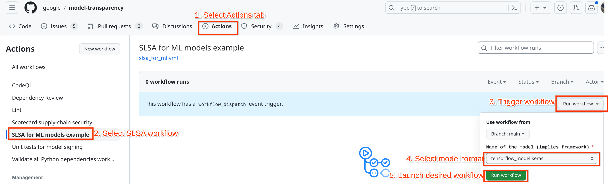
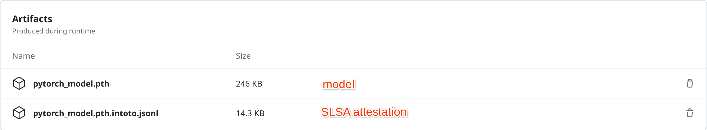

## SLSA for Models in GitHub Actions

This example uses [SLSA L3 GitHub generator][slsa-generator] to generate SLSA
provenance for ML models in GitHub Actions. This happens during a
[workflow][workflow] which takes as input the format to save the model into.

When users download a given version of a model they can also check its
provenance by using [the SLSA verifier][slsa-verifier] repository.

To test, fork this repository, then head over to the Actions tab and select the
"SLSA for ML models example" workflow. Since the workflow has a
`workflow_dispatch` trigger, it can be invoked on demand: click the `Run
workflow` button, then select the value for the "Name of the model" argument.



The supported formats are:

| Workflow Argument            | Training Framework | Model format                    |
|------------------------------|--------------------|---------------------------------|
| `tensorflow_model.keras`     | TensorFlow         | Keras format (default)          |
| `tensorflow_hdf5_model.h5`   | TensorFlow         | Legacy HDF5 format              |
| `tensorflow_hdf5.weights.h5` | TensorFlow         | Legacy HDF5 weights only format |
| `pytorch_model.pth`          | PyTorch            | PyTorch default format          |
| `pytorch_full_model.pth`     | PyTorch            | PyTorch complete model format   |
| `pytorch_jitted_model.pt`    | PyTorch            | PyTorch TorchScript format      |

After the workflow finishes execution, there will be two archives in the
"Artifacts" section: one is the model that was trained and the other one is the
SLSA provenance attached to the model.



To verify the provenance, download both archives, unzip each and then run
`slsa-verifier`, making sure to replace the `--source-uri` argument with the
_path to your fork_. For example, for a PyTorch model, which has been [built on
this repository](https://github.com/sigstore/model-transparency/actions/runs/6646816974):

```bash
[...]$ slsa-verifier verify-artifact \
       --provenance-path pytorch_model.pth.intoto.jsonl \
       --source-uri github.com/sigstore/model-transparency \
       pytorch_model.pth
Verified signature against tlog entry index 45419124 at URL: https://rekor.sigstore.dev/api/v1/log/entries/24296fb24b8ad77a98dd03d23a78657e7f1efd3d9bea6988abbf23a72290a4ec7dc35c9edeab7ee1
Verified build using builder "https://github.com/slsa-framework/slsa-github-generator/.github/workflows/generator_generic_slsa3.yml@refs/tags/v1.9.0" at commit ac26cbf66849cfec6f29747f4525180595c7eef0
Verifying artifact pytorch_model.pth: PASSED

PASSED: Verified SLSA provenance
```

The verification of provenance can be done just before the model gets loaded in
the serving pipeline.

[cifar10]: https://www.cs.toronto.edu/~kriz/cifar.html
[slsa-generator]: https://github.com/slsa-framework/slsa-github-generator
[slsa-verifier]: https://github.com/slsa-framework/slsa-verifier/
[slsa]: https://slsa.dev
[solarwinds]: https://www.techtarget.com/whatis/feature/SolarWinds-hack-explained-Everything-you-need-to-know
[tekton-chains]: https://github.com/tektoncd/chains
[tekton-kubeflow]: https://www.kubeflow.org/docs/components/pipelines/v1/sdk/pipelines-with-tekton/
[workflow]: https://github.com/sigstore/model-transparency/blob/main/.github/workflows/slsa_for_ml.yml
